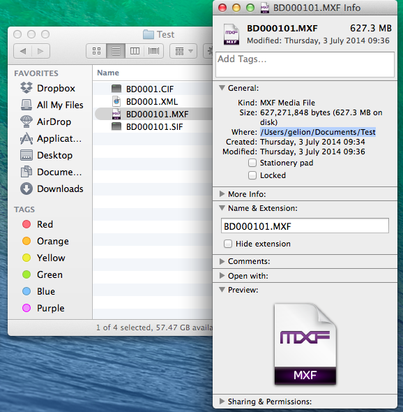
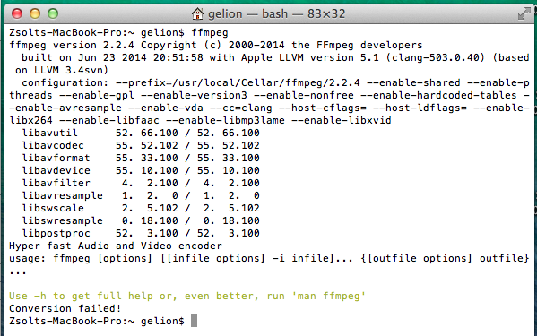
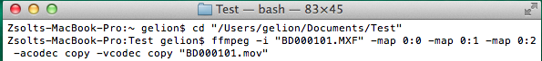
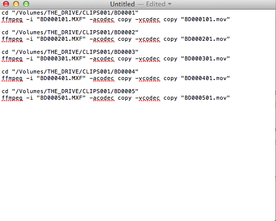

Command Line basics
==================

Starting the terminal
--------------------------

To open up the command line:

- on OSX press <kbd>CMD</kbd>+<kbd>SPACE</kbd> and enter `terminal`
- on Windows press <kbd>START</kbd>, and enter `cmd`

After opening it should look like this (on OSX): 

Basic commands
--------------------

Some basic commands (you have to press <kbd>ENTER</kbd> after entering each commands. Also note that commands are usually case sensitive, so you have to type them all lowercase):

- `ls`: show the contents of the current directory. Note that when starting up the terminal it will always start in your home directory:

  
- `cd <directory name>`: enters the named directory. e.g. if you type `cd Documents` it will enter the Documents directory:

  
- `cd`: without any parameters (like `Documents`), `cd ` will simply return you to the home directory

Figuring out directory and file names
----------------------------------------------

Usually you want to enter commands in the directory where the source file is. The easiest way to figure out where that directory is, is via Finder's Get Info option. To use it, right click on your source file (like the `.MXF` file you want to convert, and then click "Get Info"):

 

Once you press "Get Info" the directory will be shown in the "Where" section:

Just select all of the text there (including the initial `/` character), and copy it using <kbd>CMD</kbd>+<kbd>C</kbd>.

Next if you go to the terminal simply enter the following

    cd "Paste the directory's name here"

Something like this:

So basically enter `cd`, a space, a quotation mark (`"`), paste the directory name (using <kbd>CMD</kbd>+<kbd>V</kbd>), add another quotation mark, and then press <kbd>ENTER</kbd>

Sometimes you will also need to know the file's name as well. You can find the file's name in the "Name & Extension" section of the "Get Info" dialog box inside Finder. Please make sure that "Hide extension" is unselected (check image above).

Command line tricks
--------------------------

Some tricks to use when using the command line:

* The arrow keys <kbd>UP</kbd> and <kbd>DOWN</kbd> can reload previously entered commands. You can edit and re-run them later in case you made a typo, or want to modify something in them
* Pressing <kbd>CTRL</kbd>+<kbd>C</kbd> at any time will forfeit the currently entered command
* If you know the initials of the filename or directory you want to type, you only need to type the first few characters of it, then press <kbd>TAB</kbd>. The terminal will automatically fill in the rest of the characters if it's possible.
* To make it harder to make typos it's preferred to copy and paste the filenames and directory names over from finder to the terminal. Never forget to surround them in quotes though!

FFMPEG basics
=============

Note, that for these commands to work you have to install ffmpeg first on your machine. To install it you need to have administrator access to the computer. You can find the installation instructions in a later section.

To test whether ffmpeg is working and installed correctly on your computer, start up a terminal, and enter `ffmpeg`:

If ffmpeg is installed correctly it should return a wall of text similar to the image above.

Getting information about a file
---------------------------------------

To get some information about a file, first enter the file's directory (check the previous section on how to do that), then enter the following command:

    cd "file's directory"
    ffmpeg -i "file's name"

(so it's `ffmpeg` then a space, then minus, then `i`, then another space, quotation marks (`"`), the file name pasted over from Finder, then another quotation mark, and finally <kbd>ENTER</kbd>.

The result should look like this (the screenshot includes the `cd` to enter the directory, and the actual `ffmpeg` command to get information about the file):

The important information about the file (bitrate, framerate, codec, video size, video and audio stream information) can usually be found at the bottom of the screen (marked in red on the image).

Converting the file to a different container
-----------------------------------------------------

To convert an `MXF` file to a different container without transcoding you have to enter the following command:

    cd "input file's directory"
    ffmpeg -i "input filename" -map 0:0 -map 0:1 -map 0:2 -acodec copy -vcodec copy "output filename"

Or, for simpler video files (for example `mp4`, `mov` or `m2t`):

    ffmpeg -i "input filename" -acodec copy -vcodec copy "output filename"

Let's split upt he command into small pieces:

* `-i "input filename"` will tell ffmpeg what the input file is
*  `-map 0:0` will tell ffmpeg to include stream number `0:0` in the result file. As the input file contained three streams (as it can be seen from the previous screenshot: `0:0`, `0:1` and `0:2`) we have to tell him to include all three of them. Note that `ffmpeg` by default will include one video and one audio stream, so if the input file only contains one audio and one video stream (as common for video files) `-map` doesn't need to be specified
* `-acodec copy` will tell ffmpeg not to convert the audio stream but keep it as-is. This will maintain the audio stream's quality
* `-vcodec copy` will tell ffmpeg not to convert the video stream but keep it as-is. This will maintain the video stream's quality, and will also quicken the conversion, as no transcoding will take place.
* `"output filename"`: ffmpeg will know the target container type from the name of the output filename. So for example if you want to convert `"BD000401.MXF"` to a mov container, your output filename has to be `"BD000401.mov"`

Here is an example on how to convert our test `MXF` video into `MOV` without transcoding it's audio or video contents:

    ...
    

Editing out a section of the file
--------------------------------------

To quickly cut out a section of the file you can use the following command:

    cd "input file's directory"
    ffmpeg -i "input filename" -map 0:0 -map 0:1 -map 0:2 -acodec copy -vcodec copy -ss HH:MM:SS -t HH:MM:SS "output filename"

Note, that most of the command is exactly the same as the previous command was, apart from the inclusion of two additional (optional) parameters:

* `-ss HH:MM:SS` will only process the video from the specified hours, minutes and seconds. So if you only need the video from the 10th minute specify `-ss 00:10:00`
* `-t HH:MM:SS` will only process the given amount of video. So if you only need 5 seconds of footage, then enter: `-t 00:00:05`
* `-to HH:MM:SS` will only process the video until the specified hours, minutes and seconds. So if you only need the video until the 10th minute specify `-to 00:10:00`

The above commands are entirely optional. If only `-ss` is set, then video processing will begin at that moment, and will run until the end of the file. If only `-t` is set, then video processing will start at the beginning, but will stop after the specified amount of time. Note that `-t` and `-to` cannot be used at the same time.

Also note, that when copying streams (using `-vcodec copy`), then it's possible that due to the restrictions of the codec the start and end times might differ a few seconds from the specified amounts (for example instead starting at the 10 minute mark, it will actually start at 9 minutes and 58 seconds)

If needed you can also specify the start and end time in milliseconds using the `HH:MM:SS.MMM` format, for example `01:23:45.678`

Video transcoding
----------------------

Sometimes it is necessary to transcode the video, and not just copy it into a new container. To transcode the video the vcodec part needs to be changed like this:

    cd "input file's directory"
    ffmpeg -i "input filename" -map 0:0 -map 0:1 -map 0:2 -acodec copy -vcodec libx264 -b:v 10000k "output filename"

This will copy the audio streams, but convert the video stream to H.264. `-b:v` specifies the target bitrate. Of course the coding can be fine tuned further, it's advised to consult other ffmpeg guides on how to fine tune the result. Some guidelines:

- `-b:v` sets the bitrate of the result video. For SD contents in H.264 it is advised to set this between `2000-5000`. For 720p `5000-10000` is advised, for 1080p `10000-20000` or even more (depending on context)
- Alternatively you can use `-crf 20` to set a constant rate factor of 20, which return usually good results. Lower values mean better quality (so `-crf 15` would result in a file which takes up more space, but is considered to have a better quality)

Audio transcoding
----------------------

Sometimes it is necessary to transcode the audio, and not just copy it into a new container. To transcode the audio part the acodec part needs to be changed from `-acodec copy` to one of the following:

* `-acodec libfaac -b:a 128k`: it will use AAC encoding with a bitrate of 128k
* `-acodec libmp3lame -b:a 128k`: it will use MP3 encoding with a bitrate of 128k
* `-an`: it will remove the audio from the results

Note, that for `mov` and `mp4` containers using AAC is preferred, but unfortunately not all `ffmpeg` version support it.

Installing ffmpeg
==============

There are various ways to install ffmpeg onto OSX. The preferred way is via [Homebrew](http://brew.sh/), but that involves installing XCode and additional programming tools to work.

A bit more user friendly way to install ffmpeg is to download a pre-built version from [http://ffmpegmac.net/](http://ffmpegmac.net/), and install it separately. To do that:

1. Download the appropriate version from the site (usually the 64-bit version, unless you're using an old mac)
2. Extract the downloaded file (double click the file)
3. In Finder press <kbd>CMD</kbd>+<kbd>SHIFT></kbd>+<kbd>G</kbd>
4. Enter `/usr/local`
5. Create a new directory, called `bin`, if it doesn't exist
6. Copy the extracted `ffmpeg` file to this directory

Note, that for steps 5 and 6 you will need administrator rights.

An alternative way (that doesn't require administrator access) is to copy the `ffmpeg` file to the `Documents` directory, and enter the following command exactly as shown here every time you start up a terminal:

    export PATH=~/Documents:$PATH

This method is only plausible if you don't have administrator rights and cannot get ffmpeg installed any other way.

Creating scripts
=============

To convert multiple files in one batch sometimes it's easier to create a separate script file that contains the commands that need to be entered. To create a script file do the following:

1. Open up TextEdit
2. Under "Format" select "Make Plain Text"
3. Under "Edit", select "Substitutions" and make sure everything is disabled

Steps 2 and 3 will make sure that anything you enter will be preserved, so it will be supported by the command line.

Now inside the editor you can type any commands you want. Usually you want to call `cd` and `ffmpeg` after each other multiple times, but with the directory and file names changed.

Example:

After writing the script, save it as a `.txt` file in Documents. Let's save it as `coding.txt`

After it is saved open up a terminal, go to the Documents folder, and run the script using the following commands:

    cd Documents
    . coding.txt

So after the initial `cd` command enter a dot (`.`), a space, and the name of the file (including the extension).

Note that this will run the commands after each other, even if one of the encounters an error, so it is advised to only run the script with one `ffmpeg` command initially, and if it goes well add the remaining commands later, and re-run the script.
